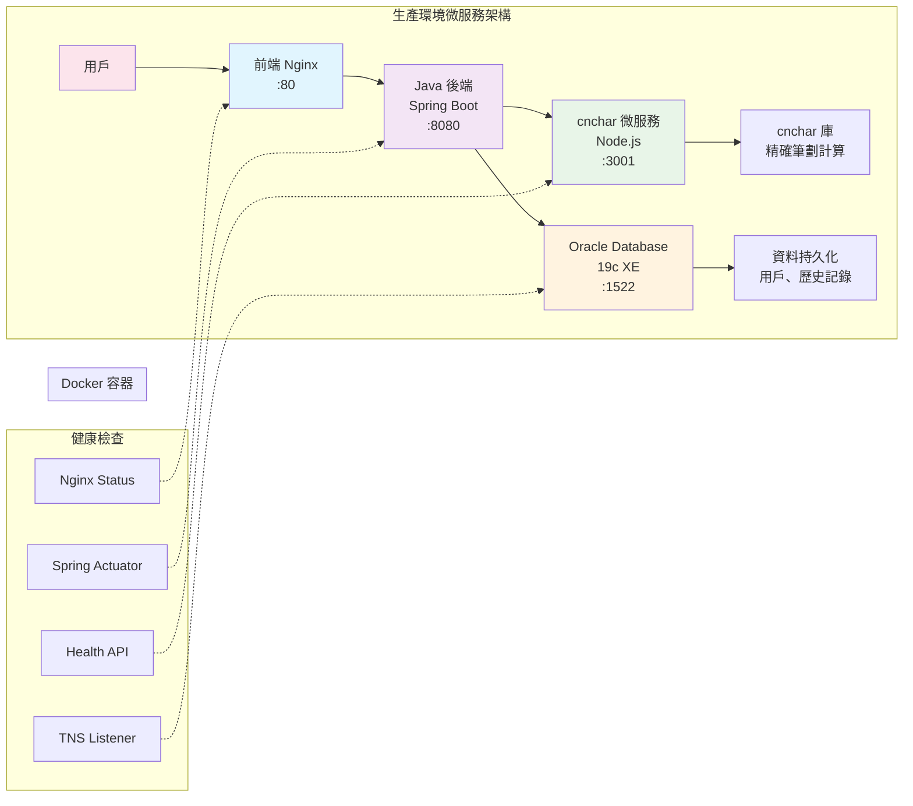

# 算命網站部署指南

## 🏗 架構概述

這是一個基於微服務架構的現代化算命網站，採用Docker容器化部署。項目展示了以下技術能力：

### 🛠 技術棧
- **後端**: Java 17 + Spring Boot 3.x + Spring Security + JPA + Oracle
- **前端**: HTML5 + CSS3 + JavaScript ES6+ + jQuery + Bootstrap 5  
- **資料庫**: Oracle Database 19c (Docker容器)
- **微服務**: cnchar筆劃計算服務 (Node.js + Express)
- **容器化**: Docker + Docker Compose
- **第三方庫**: cnchar + cnchar-trad (中文筆劃計算)

### 🏛 微服務架構



### ✨ 主要功能
1. **生辰八字算命** - 天干地支、五行分析、命理解讀
2. **姓名算命** - 基於cnchar庫的精確筆劃計算、五行屬性  
3. **每日運勢** - 十二生肖運勢、幸運顏色和數字
4. **算命歷史** - 個人算命記錄保存和查詢
5. **用戶系統** - 安全的註冊登錄、BCrypt密碼加密

## 🚀 快速部署

### 環境要求
- **Docker** 20.10+
- **Docker Compose** 2.0+
- **Git**
- **至少 4GB RAM** (Oracle容器需要較多內存)

### 一鍵部署
```bash
# 1. 克隆項目
git clone <repository-url>
cd fate-compass

# 2. 啟動所有服務
docker-compose up -d

# 3. 等待Oracle完全啟動（首次需要5-10分鐘）
./wait-for-oracle.sh

# 4. 檢查所有服務狀態
docker-compose ps
```

### 服務啟動順序
系統會自動按以下順序啟動服務：
1. **Oracle Database** (約5-10分鐘首次啟動)
2. **cnchar微服務** (等待3001端口可用)
3. **Java後端** (等待Oracle和cnchar就緒)
4. **前端Nginx** (最後啟動)

## 🌐 服務訪問

| 服務 | 地址 | 用途 | 狀態檢查 |
|------|------|------|----------|
| **前端界面** | http://localhost | 主要用戶界面 | 瀏覽器直接訪問 |
| **後端API** | http://localhost:8080/api | RESTful API | `curl http://localhost:8080/api/fortune/test` |
| **cnchar服務** | http://localhost:3001 | 筆劃計算API | `curl http://localhost:3001/health` |
| **Oracle資料庫** | localhost:1522 | 資料持久化 | `docker exec -it fate-compass-oracle sqlplus system/oracle@xe` |

## 📁 Docker服務配置

### docker-compose.yml結構
```yaml
services:
  oracle:          # Oracle 19c XE
    image: gvenzl/oracle-xe:latest
    ports: ["1522:1521"]
    
  cnchar:          # cnchar筆劃計算微服務
    build: ./cnchar-service
    ports: ["3001:3001"]
    
  backend:         # Java Spring Boot後端
    build: ./backend
    ports: ["8080:8080"]
    depends_on: [oracle, cnchar]
    
  frontend:        # Nginx前端
    build: ./frontend
    ports: ["80:80"]
```

### 健康檢查機制
每個服務都配置了健康檢查：
- **Oracle**: 檢查TNS監聽和資料庫就緒
- **cnchar**: 檢查HTTP響應 `/health`
- **backend**: 檢查Spring Boot Actuator
- **frontend**: 檢查Nginx狀態

## 🔧 系統管理

### 重啟服務
```bash
# 重啟整個系統（推薦）
./restart-system.sh

# 重啟特定服務
docker-compose restart fate-compass-backend
docker-compose restart fate-compass-cnchar

# 查看服務日誌
docker-compose logs -f fate-compass-backend
docker-compose logs -f fate-compass-oracle
```

### 清理和重建
```bash
# 停止所有服務
docker-compose down

# 清理數據卷（重置資料庫）
docker-compose down -v

# 重建所有鏡像
docker-compose build --no-cache

# 重新啟動
docker-compose up -d
```

## 📡 API接口文檔

### 算命服務 (/api/fortune)
```http
POST /api/fortune/bazi-fortune     # 生辰八字算命
  Body: { "birthDate": "1990-01-01", "birthTime": "08:00", "birthPlace": "台北" }

POST /api/fortune/name-fortune     # 姓名算命  
  Body: { "name": "王明華" }

POST /api/fortune/daily-fortune    # 每日運勢
  Body: { "zodiac": "龍" }

GET /api/fortune/history           # 算命歷史
  Headers: Authorization: Bearer <token>
```

### 用戶服務 (/api/user)
```http
POST /api/user/register            # 用戶註冊
  Body: { "username": "test", "email": "test@example.com", "password": "123456" }

POST /api/user/login               # 用戶登錄
  Body: { "loginId": "test", "password": "123456" }

GET /api/user/profile              # 用戶資料
  Headers: Authorization: Bearer <token>
```

### cnchar微服務 (:3001)
```http
GET /health                        # 健康檢查
GET /stroke/:char                  # 單字筆劃: /stroke/王 → {"strokes":4}
POST /strokes                      # 字符串筆劃
  Body: { "text": "王明華" }       # → {"totalStrokes":26}
POST /batch                        # 批量計算
  Body: { "names": ["王明", "李華"] }
```

## 🗄 資料庫管理

### 連接資料庫
```bash
# 使用Docker exec連接
docker exec -it fate-compass-oracle sqlplus system/oracle@xe
# 密碼: oracle

# 或使用外部工具連接
# Host: localhost
# Port: 1522  
# SID: XE
# Username: system
# Password: oracle
```

### 資料庫結構
```sql
-- 主要表結構
FC_USERS             -- 用戶表
FC_FORTUNE_HISTORY   -- 算命歷史表

-- 索引 (8個)
-- 觸發器 (3個) 
-- 視圖 (3個)
-- 存儲過程 (2個)
-- 函數 (1個)
```

### 測試數據
系統已內建完整測試數據：
- **5個測試用戶**: test1@example.com ~ test5@example.com
- **密碼**: password (BCrypt加密)
- **10條算命記錄**: 包含八字、姓名、運勢各種類型

## 🧪 測試和驗證

### 筆劃計算測試
```bash
# 測試cnchar微服務
curl "http://localhost:3001/stroke/王"
# 預期: {"character":"王","strokes":4,...}

curl -X POST -H "Content-Type: application/json" \
  -d '{"text":"王明"}' http://localhost:3001/strokes
# 預期: {"totalStrokes":12,...}
```

### 完整功能測試
```bash
# 1. 用戶註冊
curl -X POST http://localhost:8080/api/user/register \
  -H "Content-Type: application/json" \
  -d '{"username":"demo","email":"demo@test.com","password":"123456"}'

# 2. 用戶登錄
curl -X POST http://localhost:8080/api/user/login \
  -H "Content-Type: application/json" \
  -d '{"loginId":"demo","password":"123456"}'

# 3. 姓名算命（使用cnchar計算）
curl -X POST http://localhost:8080/api/fortune/name-fortune \
  -H "Content-Type: application/json" \
  -d '{"name":"王明"}'
```

## 🚨 故障排除

### Oracle啟動問題
```bash
# 問題: Oracle容器啟動緩慢
# 解決: 首次啟動需要5-10分鐘，請耐心等待
docker logs -f fate-compass-oracle

# 問題: ORA-12528 監聽器未啟動
# 解決: 等待Oracle完全初始化
./wait-for-oracle.sh
```

### cnchar服務問題
```bash
# 檢查cnchar服務狀態
curl http://localhost:3001/health

# 查看cnchar服務日誌
docker logs fate-compass-cnchar

# 重啟cnchar服務
docker-compose restart fate-compass-cnchar
```

### 後端連接問題
```bash
# 檢查後端服務狀態
docker logs fate-compass-backend

# 檢查Oracle連接
# 後端會等待Oracle就緒後才啟動
```

### 端口衝突
```bash
# 檢查端口佔用
netstat -tulpn | grep -E "(80|8080|3001|1522)"

# 修改docker-compose.yml中的端口映射
# 例如: "8081:8080" 改為8081端口
```

## 🔒 安全配置

### 資料庫安全
- **專用用戶**: 使用fate_compass用戶，非system帳號
- **最小權限**: 僅授予必要的資料庫權限
- **密碼加密**: BCrypt加密用戶密碼

### 應用安全  
- **Spring Security**: 完整的認證授權框架
- **CORS配置**: 僅允許指定來源的請求
- **SQL注入防護**: JPA參數化查詢
- **XSS防護**: 前端輸入驗證

### 網絡安全
```yaml
# 服務間網絡隔離
networks:
  fate-compass-network:
    driver: bridge
```

## 📊 監控和日誌

### 服務監控
```bash
# 查看所有服務狀態
docker-compose ps

# 查看資源使用情況
docker stats

# 檢查健康狀態
docker-compose exec backend curl localhost:8080/actuator/health
```

### 日誌管理
```bash
# 查看實時日誌
docker-compose logs -f

# 查看特定服務日誌
docker-compose logs fate-compass-backend
docker-compose logs fate-compass-cnchar
docker-compose logs fate-compass-oracle

# 保存日誌到文件
docker-compose logs > system.log
```

## 🚀 性能優化

### Oracle優化
- **連接池**: HikariCP連接池管理
- **索引**: 已創建必要索引提高查詢效率
- **內存**: 為Oracle容器分配足夠內存

### cnchar服務優化
- **緩存**: 筆劃計算結果可能會被緩存
- **批量計算**: 支援批量筆劃計算API
- **輕量容器**: 基於Alpine Linux的小尺寸鏡像

### 前端優化
- **CDN**: 使用CDN加載Bootstrap、jQuery
- **資源壓縮**: Nginx啟用gzip壓縮
- **緩存策略**: 設置適當的HTTP緩存頭

## 📈 擴展和升級

### 水平擴展
```yaml
# 可以通過修改docker-compose.yml實現服務擴展
services:
  backend:
    deploy:
      replicas: 2    # 運行多個後端實例
  cnchar:
    deploy:  
      replicas: 2    # 運行多個cnchar實例
```

### 版本升級
```bash
# 升級特定服務
docker-compose pull oracle
docker-compose up -d oracle

# 升級應用代碼
git pull
docker-compose build backend
docker-compose up -d backend
```

## 🎯 生產部署建議

### 環境變數
```bash
# 生產環境建議使用環境變數
export ORACLE_PASSWORD=your_secure_password
export JWT_SECRET=your_jwt_secret
export CNCHAR_API_KEY=your_api_key
```

### 資料備份
```bash
# 設置定期資料備份
# Oracle
docker exec fate-compass-oracle expdp system/oracle schemas=FATE_COMPASS

# 數據卷備份
docker run --rm -v fate-compass_oracle-data:/data -v $(pwd):/backup alpine tar czf /backup/oracle-backup.tar.gz /data
```

### SSL證書
```nginx
# Nginx SSL配置範例
server {
    listen 443 ssl;
    ssl_certificate /etc/ssl/certs/your-cert.pem;
    ssl_certificate_key /etc/ssl/private/your-key.pem;
}
```

---

## 📞 技術支援

本項目為面試技術展示項目，完整展現了：

✅ **微服務架構設計**  
✅ **Docker容器化部署**  
✅ **Oracle企業級資料庫**  
✅ **第三方庫集成**  
✅ **前後端分離**  
✅ **現代化DevOps實踐**  

如有技術問題，請參考本文檔或檢查服務日誌進行排查。

*最後更新: 2025年6月*