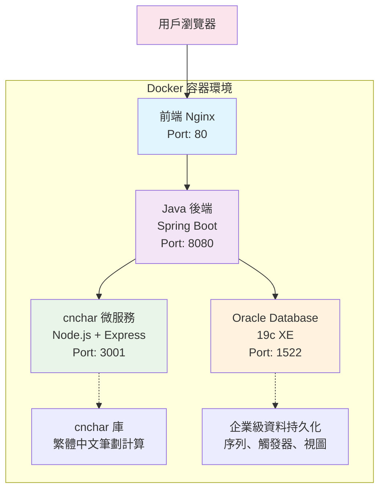

# 算命網站 (Fate Compass)

[](https://github.com/your-username/fate-compass)
[](LICENSE)
[](docker-compose.yml)
[](https://spring.io/projects/spring-boot)

一個基於微服務架構的現代化算命網站，展示前後端分離、Docker部署和第三方庫集成技術。

## 📋 版本資訊

**當前版本**: v1.0.0  
**發布日期**: 2025-06-30

### 🎉 v1.0.0 新功能
- ✅ **環境變數支援**: 前後端完整支援環境變數配置，適合外網部署
- ✅ **生產環境配置**: 新增 `application-production.yml` 生產環境優化配置
- ✅ **動態API配置**: 前端自動檢測環境並配置正確的API地址
- ✅ **安全性增強**: JWT密鑰、資料庫密碼等敏感資訊支援環境變數注入
- ✅ **CORS動態配置**: 支援多域名動態CORS配置
- ✅ **Docker優化**: 容器化部署與環境變數完美集成
- ✅ **文檔完善**: 新增詳細的環境變數配置指南

### 🔧 技術改進
- 前端 `env.js` 自動環境檢測
- 後端多Profile配置支援
- 生產環境日誌優化
- 安全性配置增強

## 🏗 系統架構

本項目採用微服務架構，包含以下服務：
- **Oracle Database** - 主要資料庫
- **cnchar微服務** - 負責中文筆劃計算
- **Java後端** - 核心業務邏輯API
- **前端** - 用戶界面



## 🛠 技術棧

### 後端技術
- **Java 17** + Spring Boot 3.x
- **Spring Security** + JWT認證
- **Spring Data JPA** + Oracle驅動
- **RESTful API** 設計
- **Maven** 項目管理

### 前端技術
- **HTML5/CSS3** + Bootstrap 5
- **JavaScript ES6+** + jQuery 3.x
- **Ajax** 異步請求
- **響應式設計** 支援手機平板

### 微服務架構
- **cnchar微服務** - Node.js + Express
- **Oracle Database 19c** 
- **Docker Compose** 容器編排
- **健康檢查** 和服務依賴管理

### 第三方庫集成
- **cnchar** - 真正的繁體中文筆劃計算庫
- **cnchar-trad** - 繁體字支援擴展

## ✨ 功能特色

1. **生辰八字算命** - 天干地支、五行分析、命理解讀
2. **姓名算命** - 基於cnchar庫的精確筆劃計算、五行屬性
3. **每日運勢** - 十二生肖運勢、幸運顏色和數字
4. **算命歷史** - 個人算命記錄保存和查詢
5. **用戶系統** - 安全的註冊登錄、密碼加密

## 📁 項目結構

```
fate-compass/
├── backend/                    # Java Spring Boot後端
│   ├── src/main/java/         # Java源碼
│   │   └── com/fatecompass/
│   │       ├── controller/    # REST控制器
│   │       ├── service/       # 業務邏輯
│   │       ├── entity/        # JPA實體
│   │       └── repository/    # 資料訪問層
│   ├── src/main/resources/    # 配置文件
│   └── pom.xml               # Maven依賴配置
├── frontend/                  # 前端靜態資源
│   ├── css/style.css         # 自定義樣式
│   ├── js/app.js             # 前端邏輯
│   └── index.html            # 主頁面
├── cnchar-service/           # cnchar微服務
│   ├── server.js             # Node.js服務器
│   ├── package.json          # npm依賴
│   └── Dockerfile            # 容器配置
├── database/                 # 資料庫腳本
│   ├── schema.sql            # Oracle表結構
│   └── data.sql              # 測試數據
├── docker-compose.yml        # Docker編排配置
├── restart-system.sh         # 系統重啟腳本
└── wait-for-oracle.sh        # Oracle等待腳本
```

## 🚀 快速啟動

### 前置要求
- **Docker** 和 **Docker Compose**
- **Git** 

### 一鍵啟動 (本地開發)
```bash
# 克隆項目
git clone <repository-url>
cd fate-compass

# 啟動所有服務
docker-compose up -d

# 等待Oracle完全啟動（首次需要約5-10分鐘）
./wait-for-oracle.sh

# 檢查服務狀態
docker-compose ps
```

### 生產環境部署
```bash
# 1. 設定環境變數
cp ENV_CONFIG.md .env
nano .env  # 編輯生產環境配置

# 2. 設定後端生產配置
export SPRING_PROFILES_ACTIVE=production
export DATABASE_URL=jdbc:oracle:thin:@your-prod-oracle:1521:PRODDB
export DATABASE_PASSWORD=your_secure_password
export JWT_SECRET=your_super_secure_jwt_secret
export CORS_ALLOWED_ORIGINS=https://your-domain.com

# 3. 更新前端API配置
# 編輯 frontend/js/env.js 或在建置時注入
# window.ENV.API_BASE_URL = 'https://api.your-domain.com/api'

# 4. 啟動生產服務
docker-compose -f docker-compose.production.yml up -d
```

### 系統重啟
```bash
# 重啟整個系統（確保正確的啟動順序）
./restart-system.sh
```

## 🌐 服務訪問

| 服務 | 地址 | 說明 |
|------|------|------|
| **前端界面** | http://localhost | 主要用戶界面 |
| **後端API** | http://localhost:8080/api | RESTful API服務 |
| **cnchar服務** | http://localhost:3001 | 筆劃計算API |
| **Oracle資料庫** | localhost:1522 | 資料庫連接 |

## ⚙️ 環境變數配置

本項目完整支援環境變數配置，適合各種部署環境。詳細配置請參考 [ENV_CONFIG.md](ENV_CONFIG.md)。

### 🔧 快速配置

**後端環境變數**:
```bash
DATABASE_URL=jdbc:oracle:thin:@your-oracle:1521:XE
DATABASE_PASSWORD=your_secure_password
JWT_SECRET=your_jwt_secret
CNCHAR_SERVICE_URL=http://your-cnchar:3001
CORS_ALLOWED_ORIGINS=https://your-domain.com
```

**前端環境配置**:
```javascript
// 直接編輯 frontend/js/env.js
window.ENV = {
    API_BASE_URL: 'https://api.your-domain.com/api',
    CNCHAR_API_URL: 'https://cnchar.your-domain.com',
    NODE_ENV: 'production'
};


```

### 🌐 外網部署要點

1. **CORS配置**: 確保 `CORS_ALLOWED_ORIGINS` 包含你的前端域名
2. **API地址**: 前端會自動檢測環境並設定正確的API地址
3. **安全性**: 生產環境務必更換JWT密鑰和資料庫密碼
4. **HTTPS**: 建議生產環境使用HTTPS協議

## 📡 API文檔

### 算命服務 (FortuneController)
```http
POST /api/fortune/bazi-fortune    # 生辰八字算命
POST /api/fortune/name-fortune    # 姓名算命
POST /api/fortune/daily-fortune   # 每日運勢
GET  /api/fortune/history         # 算命歷史
```

### 用戶服務 (UserController)
```http
POST /api/user/register           # 用戶註冊
POST /api/user/login              # 用戶登錄
GET  /api/user/profile            # 用戶資料
```

### cnchar微服務
```http
GET  /health                      # 健康檢查
GET  /stroke/:char                # 單字筆劃
POST /strokes                     # 字符串筆劃
POST /batch                       # 批量計算
```

## 💎 技術亮點

### 1. 精確筆劃計算
- 使用專業的 **cnchar庫** 進行繁體中文筆劃計算
- 支援複雜漢字的準確筆劃統計
- 微服務架構確保計算服務的獨立性

### 2. 微服務架構
- **服務分離**：業務邏輯、筆劃計算、資料庫各自獨立
- **容器化部署**：Docker Compose一鍵部署
- **健康檢查**：自動檢測服務狀態

### 3. 企業級特性
- **Spring Security**：完整的安全框架
- **Oracle資料庫**：企業級資料庫支援
- **事務管理**：JPA事務確保資料一致性
- **錯誤處理**：完善的異常處理機制

### 4. 現代化前端
- **Bootstrap 5**：現代化UI框架
- **響應式設計**：支援各種設備
- **Ajax交互**：流暢的用戶體驗

## 🔧 故障排除

### Oracle啟動緩慢
```bash
# Oracle首次啟動可能需要5-10分鐘
docker logs -f fate-compass-oracle
```

### 端口衝突
- 前端：80端口
- 後端：8080端口  
- cnchar：3001端口
- Oracle：1522端口

### 服務重啟
```bash
# 重啟特定服務
docker-compose restart fate-compass-backend

# 重啟所有服務
./restart-system.sh
```

## 🎯 開發說明

本項目專為技術面試設計，展示以下技術能力：

✅ **前後端分離架構**  
✅ **微服務設計模式**  
✅ **Docker容器化部署**  
✅ **Oracle資料庫應用**  
✅ **Spring全家桶整合**  
✅ **第三方庫集成**  
✅ **RESTful API設計**  
✅ **現代化前端開發**  

## 📝 測試數據

系統已內建測試數據，包括：
- 5個測試用戶帳號
- 10條算命歷史記錄
- 完整的姓名筆劃測試案例

測試帳號：`test1@example.com` / 密碼：`password` 